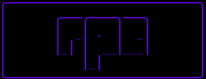

  

# Introduction 

RPC is titled Radical Processing Core ( not to get confused with Remote Procedure Call ). This article will give you a breife introduction as to how the language works, variables, tokens, design concepts etc. Unlike most tuturials RPC is still in development and will begin beta release in 2023. 

# What is RPC 

RPC stands for Radical Processing Core a language in current development by Totally_Not_A_Haxxer and the Scare Security team designed for performant but complex applications. This language was designed with the moto 

`easy applications are hard but hard applications are easy`

telling you that writing a simple application in RPC will be hard and writing an advanced application in RPC will be easier than a easy application. Confusing right? Good. RPC has a few weird concepts that go with it, here is some general information about the language.

* It is interpreted
* It is designed like a compiled language 
* It is designed with the Go programming language 
* it is a wacky language that will make you question your life

Unlike most tutorials we will not start off with a hello world program, for not this tutorial will rather be a decent introduction as to how the language is currently designed, how it may change, why it was created and why there are or will be prerequisite's to learning the language.

# RPC's design 
